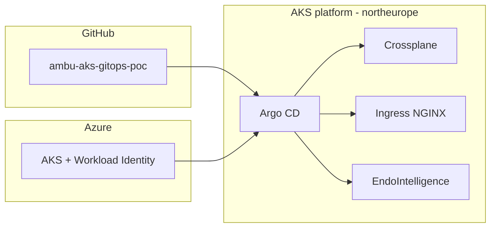

# Architecture — Ambu AKS GitOps PoC

## Context

Ambu ships visualisation and endoscopy products globally. A cloud architect for that estate needs a platform that is **EU-resident**, **GitOps-operated**, and **claim-based** so product teams (for example EndoIntelligence) do not open the Azure portal to create clusters, vaults, or registries.

This PoC is a miniature of that platform.

## C4 — containers



## Bootstrap vs desired state

| Layer | Tool | Why |
|---|---|---|
| Subscription, first RG, first AKS | Azure CLI (`scripts/bootstrap.sh`) | Operators cannot install themselves without a cluster |
| Providers, XRDs, Compositions | Crossplane via Argo CD | Azure API surface as Kubernetes APIs |
| Cluster add-ons | Argo CD `cluster/` | Ingress, namespaces, baseline NetworkPolicy |
| Product | Argo CD `apps/endointelligence` | Product team owns overlays only |

## Network (intended)

Bootstrap AKS uses Azure CNI Overlay (or kubenet in cheap labs). Composition documents the production shape:

- Spoke VNet `10.40.0.0/16`
- System node pool subnet `10.40.1.0/24`
- User node pool subnet `10.40.2.0/24`
- Private Link / private AKS is **specified but not enabled in bootstrap** (lab cost and DNS). Enable `--enable-private-cluster` for a locked-down demo.

## Identity

AKS is created with **OIDC issuer** and **Workload Identity**. Compositions currently write in-cluster ConfigMaps so claims become Ready without Upbound Azure CRDs. A follow-up composition would create a user-assigned identity, federate it to `system:serviceaccount:endointelligence-*:endointelligence`, and bind Key Vault RBAC — no secrets in Git.

## GitOps topology

```
scripts/bootstrap.sh          # applies ambu-root Application
gitops/apps/
  project-platform.yaml
  project-products.yaml
  platform-crossplane.yaml    # infra/crossplane
  cluster-baseline.yaml       # cluster/
  endointelligence-dev.yaml
  endointelligence-prod.yaml
```

Sync waves: XRDs and compositions, then claims, then product apps.

## Security baseline (PoC)

- Nginx unprivileged image, read-only root filesystem where possible
- Drop ALL capabilities, add only `NET_BIND_SERVICE` is **not** needed on 8080
- NetworkPolicy: ingress from ingress-nginx namespace only
- PodDisruptionBudget on prod
- Azure tags: `Owner=platform`, `CostCenter=endo-intelligence`, `DataClass=demo-nonclinical`

## What a Senior Cloud Architect would add next

1. Azure Front Door + WAF in front of ingress, private origin
2. External Secrets Operator + Key Vault
3. Azure Policy add-on (restricted images, no privileged pods)
4. Prometheus/Managed Grafana or Azure Monitor managed Prometheus
5. Environment promotion via ApplicationSet + PRs (dev auto, prod manual sync)
6. Landing zone: management groups, private DNS, hub firewall
7. ISO 13485 / IEC 62304 change control mapped to Git PRs (audit trail)

## Interview walk-through (10 minutes)

1. Open this README and the mermaid diagram.
2. Show `infra/crossplane/apis/ambu.platform.xrd.yaml` — product teams ask for a platform, not an ARM template.
3. Show `gitops/apps/` — one Git commit is the desired state of Azure **and** Kubernetes.
4. Show `apps/endointelligence/k8s/overlays/prod` — PDB, 3 replicas, prod namespace.
5. Call out EU region and non-clinical disclaimer.
